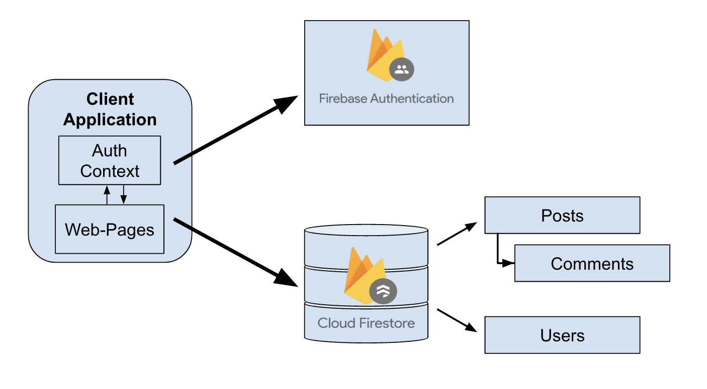

<!-- 

Welcome to EQ, the Internet place for sharing emotions, getting advice, and connecting with humans!

## Getting Started

First, run the development server:

```bash
pnpm run dev
```

Open [http://localhost:3000](http://localhost:3000) with your browser to see the result.

You can start editing the page by modifying `app/page.tsx`. The page auto-updates as you edit the file.

This project uses [`next/font`](https://nextjs.org/docs/basic-features/font-optimization) to automatically optimize and load Inter, a custom Google Font.


## Feature TODOs
- [x] Add dashboard
- [x] Add posts database
- [ ] Add posting limits
- [ ] Add post customizability
- [x] Add feed sorting
- [ ] Add post editing
- [x] Add post stats (upvotes, downvotes, comments, etc..)
- [ ] Add usernames -> display them on posts & comments
- [x] Add timestamps
- [ ] Restructure DB/posts/comments to display usernames

## Bugs TODOs
- [ ] Login works from root url, not from '/login'
- [ ] Remember me button not working
- [x] Firestore not storing additional user information -->
# EQ

A simple social media template website originally built to be a distraction-free social forum where users could chat about emotions, get advice, and connect with others. Built using Next.js, React, TypeScript, Tailwind, Firebase Authentication and Firebase Firestore.

## Getting Started

First, run the development server:

```bash
pnpm run dev
```

or 

```bash
npm run dev
```

Open [http://localhost:3000](http://localhost:3000) with your browser to see the result.

You can start editing the page by modifying `app/page.tsx` or the respective `page.tsx` files in the associated page subdirectories. The page auto-updates as you edit the file.

## Directory Structure
Within the `src/` directory there are subdirectories associated with each page of the website i.e. `feed/`, `login/`, `profile/`. Within each subdirectory is a `page.tsx` that can be edited to modify the look and feel of each page.

## Configuring Firebase
When setting up Firebase to work correctly with this web application, ensure that the `lib/` directory contains the file `firebase.ts`. This file may need to be updated with the firebase keys associated with your project. The file also contains additional information regarding setting a global rememberMe persistence and exporting the global auth.

## System Design


1. First the Client actiavtes the global auth context by making a sign-in request to the Firebase Authentication server. If sign-in is successful the auth context is correctly populated, else a sign-in error is displayed.
2. Using the global auth context, individual page actions can access data from the Firebase cloud firestores. This includes getting information such as user-info, posts, comments, etc..